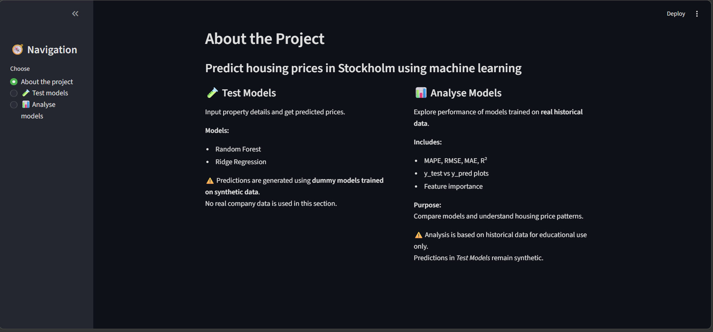
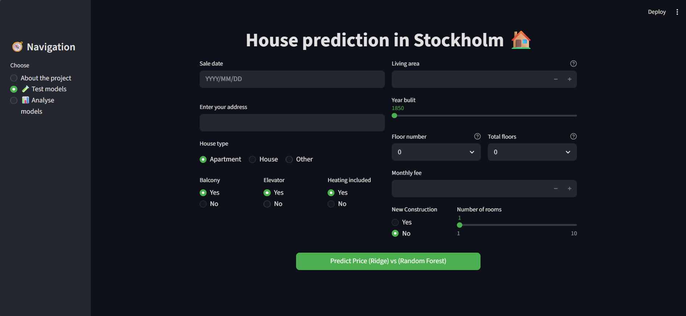
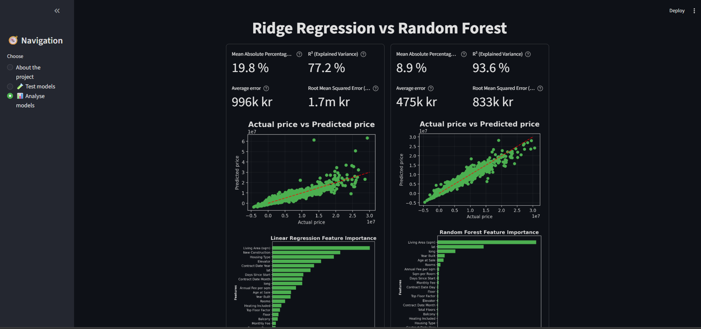

# Stockholm Housing Model

A machine learning project for predicting housing prices in Stockholm using Ridge Regression and Random Forest models, deployed as an interactive Streamlit application.

---

## 📌 Project Overview

This project focuses on predicting housing prices in Stockholm.

The application allows users to:

* Input custom housing data and receive predictions
* Compare two different models
* Analyze model performance and feature importance

⚠️ Due to data privacy constraints, real data and trained models are not included. Therefore the app uses **dummy models**.  

✅ The **Analyse Models** page shows analyses on the real models, but those models are not included in this project.

---

## 🖥️ Application Preview

### 🏠 Info Page

Overview of the application and its functionality.

<!--
[Info Page](images/info_page.png)
-->
&nbsp;&nbsp;&nbsp;&nbsp;

---

### 🧪 Test Models

Users can input their own housing data and get predictions.

&nbsp;&nbsp;&nbsp;
---

### 📊 Analyze Models

Displays metrics and feature importance from the trained models.

&nbsp;&nbsp;&nbsp;

---

## 🚀 Features

* Predict housing prices using:

  * Ridge Regression
  * Random Forest
* Compare model outputs
* Visualize:

  * Predicted vs Actual values
  * Feature importance
* Clean UI with custom Streamlit styling

---

## 📂 Project Structure

```
stockholm-housing-model/
│
├── .streamlit/
│   └── config.toml                           # Custom styling (colors, fonts)
│
├── data/
│   └── raw_synthetic.parquet                 # Synthetic dataset (dummy data)
│
├── data_manipulation/
│   ├── data_utils.py                         # Data cleaning 
│   └── feature_engineering.py                # Feature engineering
│
│
├── src/
│   └── create_models/
│       ├── random_forest_model.py            # Model training script, model with stored results will be saved in the map: saved_models
│       └── ridge_model.py                    # Model training script, model will stored results will be saved in the map: saved_models
│
├── saved_models/
│       ├── *.pkl                             # Trained models (generated locally)
|
├── visualizations/
│   └── plots.py                              # Custom plotting functions
│
├── images/                                   # Screenshots for README
│
├── app.py                                    # Streamlit app, (main file)
├── requirements.txt                          # Dependencies
└── README.md
```

---

## ⚙️ Setup

```bash
git clone https://github.com/AIGabiB/stockholm-housing-model.git
cd stockholm-housing-model
pip install -r requirements.txt
python -m streamlit run app.py
```

---

## 🧠 Models

- **Ridge Regression** – scales data, trains in a pipeline, stores results (predictions, metrics, feature importance), and saves locally as `.pkl`.
- **Random Forest** – scales data, trains in a pipeline, stores results (predictions, metrics, feature importance), and saves locally as `.pkl`.

---

## 📊 Data

* `raw_synthetic.parquet`: Dummy dataset
* Real dataset is not included due to confidentiality

### Pipeline:

1. Data cleaning → `data_utils.py`
2. Feature engineering → `feature_engineering.py`
3. Model training → `src/create_models/`

---

## 📈 Visualizations

Custom plots:

* Predicted vs Actual values
* Feature importance

Located in:

`visualizations/plots.py`

---

## 🐍 Environment

* Python 3.10.7
* See `requirements.txt`

---

## ⚠️ Disclaimer

This project uses synthetic data for demonstration purposes only.
Real data and models are excluded due to company restrictions.

The **Analyse Models** page shows analyses on the real models, but those models are not included in this project.

---

